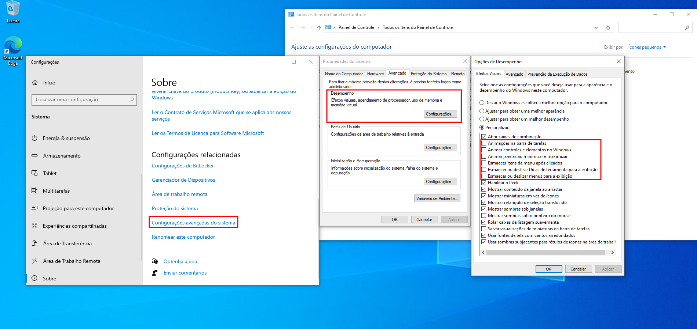
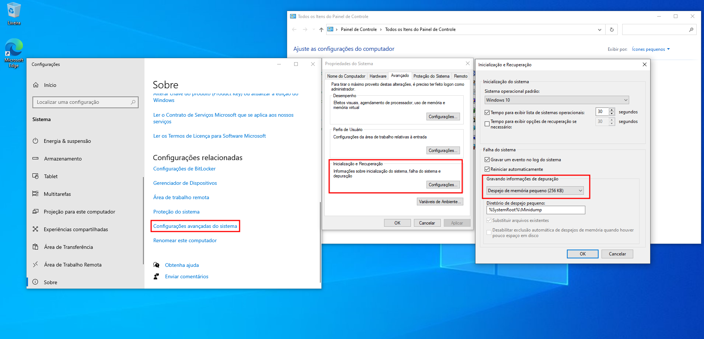

### Checklist pós instalação do Windows

- [ ] Atualizar o SO através do Windows Update

- [ ] Ativar o Windows

- [ ] Configurar a barra de tarefas

- [ ] Remover as notificações dos aplicativos

- [ ] Fixar o painel de controle na barra de tarefas para acesso rápido

- [ ] Desativar as animações do sistema 

- [ ] Habilitar despejo de memória 
